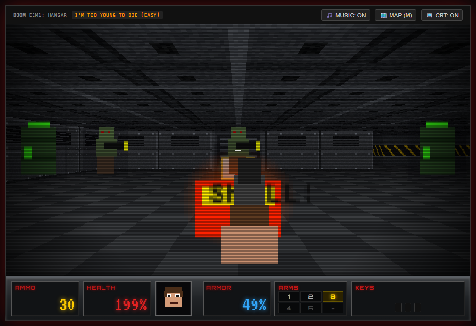
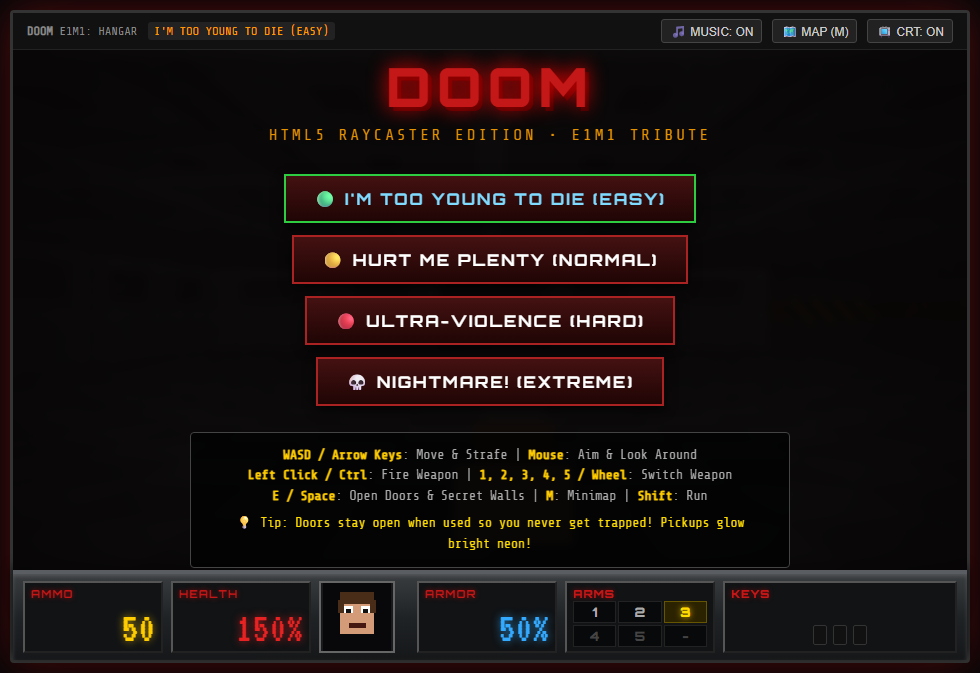

# Doom-Gemini37-ClaudeSonnet5

🎮 A fully playable tribute to **DOOM**, built from scratch with AI (Gemini 3.7) in a **single HTML file** 💥

No engines, no libraries, no assets: just pure **JavaScript**, **HTML5 Canvas**, and the **Web Audio API**.

### ▶️ [Play it now in your browser](https://ibrahimsobh.github.io/Doom-Gemini37-ClaudeSonnet5/)

## ✨ Features

### 🕹️ Engine & Graphics
- Raycasting engine with textured walls, floors, and ceilings
- Classic enemies: **Zombieman** and **Pinky Demon**
- Glowing pickups: medkits, armor, ammo, and more

### ⚔️ Weapons
Five classic weapons, with muzzle flashes and blood splatter:

| # | Weapon |
|---|--------|
| 1 | Fist |
| 2 | Pistol |
| 3 | Shotgun |
| 4 | Chaingun |
| 5 | Plasma Rifle |

### 🔊 Sound & Music
All sound effects and music are synthesized in real time with the Web Audio API. There are no audio files.

### 📟 Interactive Extras
- Animated Doomguy face in the HUD that looks around
- Minimap
- Sliding doors and secret push-walls
- Toxic floor hazards

## 🚀 How to Play
- **Online:** open the [GitHub Pages link](https://ibrahimsobh.github.io/Doom-Gemini37-ClaudeSonnet5/).
- **Offline:** clone or download this repo and open `index.html` in a modern browser.

Then pick a difficulty and rip and tear. 🔥

| Key | Action |
|-----|--------|
| WASD / Arrow keys | Move & strafe |
| Mouse | Aim & look around |
| Left click / Ctrl | Fire |
| 1–5 / Mouse wheel | Switch weapon |
| E / Space | Open doors & secret walls |
| M | Toggle minimap |
| Shift | Run |

## 🎯 Why This Project?
AI-assisted coding has reached an impressive level of fidelity. It works well for rapid prototyping and complex interactive simulations like a game engine.

Doom also matters to me personally. I used it during my PhD research in **Deep Learning, Computer Vision, and Reinforcement Learning**, so rebuilding it with AI felt like coming full circle. 🧑‍🎓

## 📄 License
Released under the [MIT License](LICENSE).
